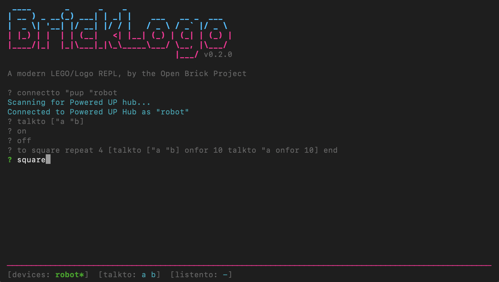

# BrickLogo



BrickLogo is a Logo programming environment for controlling LEGO® motors and sensors. It runs in a terminal and works with hardware from the original DACTA Control Lab through to current Powered UP and LEGO Education Science devices.

LEGO/Logo was designed by Mitchel Resnick, Stephen Ocko, and Seymour Papert at MIT in the 1980s to connect the Logo programming language to physical LEGO models. LEGO produced two implementations: LEGO TC Logo (1988) and LEGO DACTA Control Lab (1993). BrickLogo is a spiritual evolution of LEGO/Logo, drawing from both and adding support for current hardware.

## Quick Start

### Install (macOS / Linux)

```
curl -fsSL https://raw.githubusercontent.com/openbrickproject/BrickLogo/main/scripts/install.sh | sh
```

### Install (Windows PowerShell)

```
irm https://raw.githubusercontent.com/openbrickproject/BrickLogo/main/scripts/install.ps1 | iex
```

This installs BrickLogo to `~/.bricklogo/` and adds it to your PATH. Run `bricklogo` to start.

### Manual install

Download the [latest release](https://github.com/openbrickproject/BrickLogo/releases) for your platform, unpack it, and run the binary.

```
./bricklogo
```

Example session:

```
? connectto "pup "mybot
Scanning for Powered UP hub...
Connected to Boost Move Hub as "mybot"

? talkto "a
? setpower 50
? onfor 10

? to backandforward
> repeat 4 [onfor 5 wait 5 rd]
> end

? backandforward
```

## Supported Devices

| Type | Command | Devices |
| --- | --- | --- |
| LEGO® Education Science | `connectto "science "name` | Double Motor, Single Motor, Color Sensor, Controller |
| LEGO Powered UP | `connectto "pup "name` | Boost Move Hub, Powered UP Hub, WeDo 2.0, Technic Hub, Remote, Duplo Train |
| LEGO Education WeDo 1.0 | `connectto "wedo "name` | WeDo USB Hub |
| LEGO DACTA Control Lab | `connectto "controllab "name` | Interface B over serial |
| LEGO Mindstorms RCX | `connectto "rcx "name` | RCX via serial or USB IR tower |
| LEGO Mindstorms EV3 | `connectto "ev3 "name` | EV3 via USB or Bluetooth |
| LEGO Mindstorms NXT | `connectto "nxt "name` | NXT 1.0 / 2.0 via USB or Bluetooth |
| LEGO SPIKE Prime | `connectto "spike "name` | SPIKE Prime / Robot Inventor hub via USB or Bluetooth |
| Raspberry Pi Build HAT | `connectto "buildhat "name` | Powered UP and SPIKE motors and sensors |

Multiple devices can be connected at the same time. Each is given a name and addressed by that name or by qualified port names (for example `"mybot.a`).

## Configuration

BrickLogo looks for `bricklogo.config.json` in the current working directory. This is only needed for devices that connect over serial (Control Lab, RCX serial towers, EV3 Bluetooth, NXT Bluetooth). USB and BLE devices are detected automatically.

```json
{
  "controllab": ["/dev/tty.usbserial-AC018HBC"],
  "rcx": ["/dev/ttyS0"],
  "ev3": ["/dev/cu.EV3-SerialPort-14"],
  "nxt": ["/dev/cu.NXT-DevB"]
}
```

Serial paths are used in order as devices are connected. WeDo 1.0, RCX USB towers, EV3 USB, and NXT USB connections are detected automatically and do not need a config entry.

## Commands

Connection:

- `connectto "type "name`
- `use "name`
- `disconnect`
- `firmware "device "file` (RCX, Build HAT)

Motor control:

- `talkto "port` or `talkto [a b]`
- `on`, `off`, `onfor`, `setpower`
- `seteven`, `setodd`, `rd`
- `rotate`, `rotateto`, `resetzero`, `rotatetoabs`
- `flash`, `alloff`

Sensors:

- `listento "port`
- `sensor "mode`, `sensor?`
- `color`, `light`, `force`, `angle`

Language:

- `make`, `:variable`, `print`, `show`
- `repeat`, `forever`, `if`, `ifelse`, `waituntil`
- `to ... end`, `output`, `stop`, `erase`
- `launch`
- `wait`, `timer`, `resett`
- `namepage`, `save`, `load`, `setdisk`

Type `help` inside BrickLogo for the built-in command summary.

## Documentation

See the [docs](docs/) folder:

- [Introduction](docs/01-introduction.md)
- [Getting Started](docs/02-getting-started.md)
- [Tutorial](docs/03-tutorial.md)
- [Advanced Usage](docs/04-advanced.md)
- [Reference Guide](docs/05-reference.md)

## Development

```
cargo check
cargo test
cargo run -p bricklogo
```

## Status

BrickLogo is in active development. The goal is a usable and fun LEGO/Logo environment for automation and learning.

## License

BrickLogo is licensed under the Apache License, Version 2.0. See [LICENSE](LICENSE) for the full text.

## Trademarks

LEGO®, DACTA, Mindstorms, Powered UP, WeDo, Boost, SPIKE, and Technic are trademarks of the LEGO Group of companies, which does not sponsor, authorize, or endorse this project.

Raspberry Pi is a trademark of Raspberry Pi Ltd. BrickLogo is compatible with the Raspberry Pi Build HAT but is not affiliated with, endorsed by, or supported by Raspberry Pi Ltd.

BrickLogo is an independent, unofficial project. All product names, logos, and brands referenced in this project are the property of their respective owners. Use of these names is for identification and compatibility purposes only and does not imply any endorsement.
